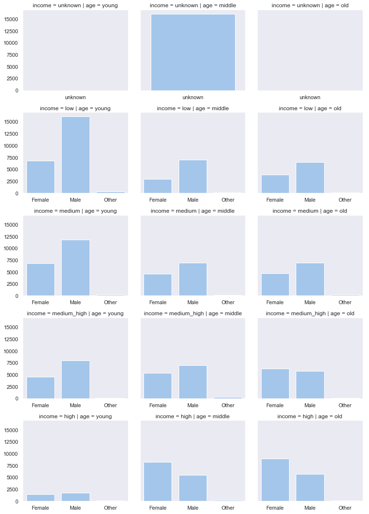

**Table Of Contents**

[TOC]

# DataScientist

**Capstone Project**

Author: RayZen

Date: 2018/11/24

## $\rm I$. Project Definition

### 1.1 Project Overview

In reality, the company often make a promotion to attract new users and maintain the long-term customer. What the main promotion strategies are: 1) Discounting, deduct an amount from the total; 2) Buy one get one method; 3) Informational. The Starbuck simulate the data that mimics customer behavior on the Starbucks rewards mobile app. There are three main conversion pathes:

1. The BOGO(Buy one get one) And the discount type
   *  Offer Received => Offer Viewed => Offer Completed => Promotion Effect
   *  Offer Received => Offer Completed => Promotion Effect
2. The information type:
   * Offer Received => Offer Viewed => Promotion Effect

All the files store the transaction record, the users information record, and the pormotion information record, which tend to figure out How is the relationship between the promotion and the users.

### 1.2 Problem Statement

The Starbucks provides different promotion type. At the customer side, maybe they make a different choice to respond to the different promotion. And there is another question that whether the users go to purchase the product more frequently. Right now, the data set contains the simulated data that mimics customer behavior on the Starbucks rewards mobile app that offer three different promotion. Now we have the appropriate data, and we are curiouse about the consumer behavior. So we put one question:

**What is the consumed amount after the promotion**

### 1.3 Metrics

As we all know, a company must make a profile to keep running. So, we want to know how much the promotion affects the profile. Now we have the amount value and another information values like demographic information and promotion information. Then the next step is model building that can make a prediction according to the demographic and the promotion, and the target label is the amount value. Now we can use the supervised machine learning to make the build.

This is a **regression problem**, so there are such many metrics being used to measure the prediction result, like $R^2$ score, mean squared error, mean absolute error. We use the $R^2$ score and the mean squared error to measure the model. Lastly, we use the one metric MSE that is the average of the squares of the errors, to evaluation the final result. The MSE formula:

$$
MSE(y, \hat{y})=\frac{\sum_{i=0}^n(y_i-\hat{y_i})^2}{n}
$$

## $\rm II$. Analysis

### 2.1 Data Exploratory

#### 2.1.1 Data Description

The data is contained in three files:

- portfolio.json, containing offer ids and meta data about each offer
  - id (string) - offer id
  - offer_type (string) - type of offer ie BOGO, discount, informational
  - difficulty (int) - minimum required spend to complete an offer
  - reward (int) - reward given for completing an offer
  - duration (int) - running time
  - channels (list of strings)
- profile.json - demographic data for each customer
  - age (int) - age of the customer
  - became_member_on (int) - date when customer created an app account
  - gender (str) - gender of the customer (note some entries contain 'O' for other rather than M or F)
  - id (str) - customer id
  - income (float) - customer's income
- ranscript.json - records for transactions, offers received, offers viewed, and offers completed
  - event (str) - record description (ie transaction, offer received, offer viewed, etc.)
  - person (str) - customer id
  - time (int) - time in hours. The data begins at time t=0
  - value - (dict of strings) - either an offer id or transaction amount depending on the record

#### 2.1.2 Data Access

**Portfolio data:**

- The attribute channels contains the different channel in one cell

  

**Transcript data:**

- The attribute value is a dict data that contains much information
- There are some duplicated values

**Profile data:**

- The attribute became_member_on is datetime type

- The attribute gender has None that represents a missing value. And the value O represents “other”, the value F represent “Female”, and the other one M represent “Male”

- The attribute age has an abnormal value that is over 100,

  

  We use the histogram to explore the age. The distribution is almost normal, but there are some abnormal value, which maybe is the max value option

- The users’ income is a right skewness

  

  We use the histogram plot to visualize the income too. We find that the number of the missing values are very large

#### 2.1.3 Data Wrangling

As the data access, we find that there are some data quantity problem. Now we need to preprocess the data, so that we can continue to analyze.

**Portfolio data**

* Get the different channel to store in the different attribute, which store the data as a dict type. Iterate the cell, pass the different value into the different columns that is the dict key.

**Profile data**

* Convert the attribute became_member_on to datetime type

* Parse the month and the year information from the became_member_on

* Transfrom the attribute gender value to the original value, and fill the missing value with unknown

* The attribute age abnormal value translate to missing value in temporary. According to another appendix information about the users age statistics, the main users' age is between 22 - 60, which agrees with the main distribution in the data. So we use the value middle to fill the missing value[^1][^2]. 

* The users' income is a right skewness, and the number of the missing values are very large. Now we take a new to deal with the income value. Firstly, we so we divide the user into the different income level. Secondly, we deal with the missing value as a new type.

**Transcript data**

* Transform the attribute value into the different attribute

* Drop the duplicated values

Finally, we need to merge the dataset, then there are new some missing value need to be fixed, like offer_type, event. We create a new attribute coresponded to the original attributue, and fill the missing value:

* The feature offer_type match the the offer_type_fix, and fill the missing value with the value No_offer

* The feature event match the event_fix, and fill the missing value with the value offer_completed

**Extraction data**

Consider that we will analyze *What is the consumed amount after the promotion*, so we need to extract the different promotion type transaction records from the transaction.

### 2.2 Data Visualization

#### 2.2.1 Users Subscribed Trend

Firstly, we explore what the trend is that the users subscribe the membership.Before 2017 July, almost 300 users join in the Starbucks membership in every 30 days. Then the new member trend increase at the top that is almost 900 users, between 2017 July and 2018 February. After 2018 February, the trend goes down to almost 600 users.


#### 2.2.2 Useres Demographic Information

Now we know that the Starbucks users demographic information features: the middle age male users; additionally, the high-level income female is the other pop users. 

1. The most transaction users are the middle-level age, but the information on the gender and the income level is missing. Furthermore, the two missing demographic attributes occupy 12.79%
2. When we control the age variable, the high-income users are not the main users; but the low-income users and the medium income users have the most transaction amount. Of course, the middle age uses are very common at the different the income level; whereas the high-level females transaction amount is higher than the high-level males. At the old age users side, the different income users are almost the same; but the high income has a much more transaction amount
3. When we control the income level variable, the young users are the primary except the high-income level and the medium-high level. It isn't almost different about the different age at the medium-high level users. It is a pop at the high-level income users except for the young users



#### 2.2.3 Offer Completed Useres

The next thing is that explore who completed the offer. So we use the merged data to visualize the completed offer transaction record. **Take an attention that we just analyze the transaction data:**


 

1. Above the image, we can know that the most users make a transaction by using the discount, especially the male uses. But there is not apparently difference like the medium level income young and old female users but the medium level income female users
2. At the transaction amount, the high income users have the most number of the transaction in each type of promotion except the high income young users

In a word, the most number of the offer completed users are the high leve income users, especially the female users. From the Starbucks side, we want to know how the long-term effect is after the promotion.

#### 2.2.4 Promotion Effect

We extract the 4, 332 users’ transaction record from the 17, 000 users’ transaction record. And the amount of the different promotion is very close to each other. We explore the growth rate after the promotion. The result is:

1. In totally, there is a **positive** effect at each strategy
2. The **informational** is much more significant than the others


#### 2.2.5 Feature Correlation

We use the heatmap to analyze the correlation:


We found that there are some high correlation between one feature and another one, like reward_compeleted, reward, duratio, duration, and so on .

### 2.3 Algorithm And Model

After extracting the transaction record about different promotion type, we can dive into analyze. At the company side, a company need make a profile to keep running. So, we want to know how much the promotion affects the profit. Now we have the amount value and another information values like demographic information and promotion information. Then the next step is model building that can make a prediction according to the demographic and the promotion, and the target label is the amount value. Now we can use the supervised machine learning to make the build. 
We use the LinearRegression method to build a basic model as a benchmark. Then we use the decision tree method DecisionTreeRegressor and the ensemble method RandomForestRegressor to tunning model.

The DecisionTreeRegressor is base on the decision tree non-parametric method. There are some advantages, like not need dummy variables (threre are some category data, like became_member_year, became_member_month). The RandomForestRegressor is a ensemble method, which can build a better model by using many weak estimator. The two methods are good at analyze the feature importance, which can verify how to Give Best Promotion To Appropriate Customer.

#### Benchmark

We use the LinearRegression to build the benchmark, and evaluate the model result by the two metrics the MSE and $R^2$ score

| Mean Squared Error | $R^2$ score Test Data | $R^2$ score Train Data |
| :----------------: | :-------------------: | :--------------------: |
|       1.1829       |        0.4732         |         0.4684         |


## $\rm III$. Methodology

### 3.1 Data Preprocessing

As what we have done, there some feature need to preprocess:

1. we know that the feature email is imbalance data, then we will drop the feature
2. The feature reward and the feature reward_complete have the high correlation, because they are same. The two features need to drop duplicates. Besides the reward_complete has missing value, and we can think that the value is 0
3. The feature duration and the feature difficulty have the high correlation. The two features can transorm as the difficulty ratio in the duration
4. There are some category variable. We need to encode the value
5. The label about is skewness. We take the log transform method
6. Dummy variable like income level, age level and promotion type

### 3.2 Implementation

Firstly, we use the DecisionTreeRegressor to build model. Besides, we build the Pipeline with GridSearchCV to tune the parameters. Secondly we use the RandomForestRegressor to build model, and verify whether the model is better. After tuning parameter, we get the best estimator about the different model:

* The DecisionTreeRegressor parameters:

  ```
  DecisionTreeRegressor(criterion='mse', max_depth=None, max_features=None,
             max_leaf_nodes=None, min_impurity_decrease=0.0,
             min_impurity_split=None, min_samples_leaf=2,
             min_samples_split=2, min_weight_fraction_leaf=0.0,
             presort=False, random_state=42, splitter='best')
  ```

* The RandomForestRegressor parameters:

  ```
  RandomForestRegressor(bootstrap=True, criterion='mse', max_depth=15,
             max_features='auto', max_leaf_nodes=None,
             min_impurity_decrease=0.0, min_impurity_split=None,
             min_samples_leaf=2, min_samples_split=2,
             min_weight_fraction_leaf=0.0, n_estimators=100, n_jobs=2,
             oob_score=False, random_state=42, verbose=0, warm_start=False)
  ```

### 3.3 Model Evaluation

During development, a validation set (test data set) is used to evaluate the model. The model is better than the benchmark. The metric $R^2$ score is going high, but the metric MSE is going down. The best score is create by the RandomForestRegressor model, because its validate $R^2$ score is $0.5925$, which is much higher than the benchmark; at the same time, the validate MSE is $0.915$, which is lower than the LinearRegression model.

| Model                 | Mean Squared Error | Test $R^2$ scoe | Train $R^2$ score |
| --------------------- | ------------------ | --------------- | ----------------- |
| DecisionTreeRegressor | 0.9423             | 0.5804          | 0.6876            |
| RandomForestRegressor | 0.9150             | 0.5925          | 0.6767            |

At last, we plot the feature importance, so that we can verify our former inference.


## $\rm IV$. Conclusion

### 4.1 Discussion

In the process of analyzing, we are stuck in some steps, especially, the data merging. The transaction data contains all transaction records. At the early step, we can't know the promotion conversion path, so that we take so many time to understand the data. At the model steps, we find that the prediction and the true value are not perfect consensuses. It is show that the 𝑅2 value is not very good. So we can make a more technical method to build a model, like the XGBoost that can use the gradient boosting method and use the penalty term $\Omega$ to avoid overfitting, in order to make an improvement

### 4.2 Data Result

Take a deep into the users demographic information with the different promotion strategy:

1. Firstly, the gender other doesn't have apparent significance
2. The new users who don't have detailed demographic value can attract by the informational promotion
3. The young low-income male users and the old low-income male can attract by the informational promotion. At the same time, the rest promotion types do have a significant impact. In totally, the young members are much more active than the other age users, at the low-income level
4. Above the medium-high income level, the discount promotion type makes a much more improve the buying amount

### 4.3 Improvement Advice

Based on the former result, we can make some advice:

1. If there are some new users, the informational is a good way to attract them
2. For young low-income level male users, the Starbucks can use the informational type as well
3. Each type can attract the young medium-income level users. Besides, Starbucks can treat the type as the pop users
4. The discount type can attract the high-income level female. When the Starbucks advertises the discount promotion, the Starbucks give more offer to the high-income level female. Besides, the high-income level users make much more contribution to the profit. Maybe the discount promotion is offered in unregular time for the class of users.

**Caution:**
The advice is an earlier idea. It is apparent that there are so many steps to verify the idea.

## $\rm A$. Reference 

[^1]: [Starbucks Demographics and Consumer Insights](http://snapshot.numerator.com/brand/starbucks) 
[^2]: [30 Curious Starbucks Demographics](https://brandongaille.com/30-curious-starbucks-demographics/) 